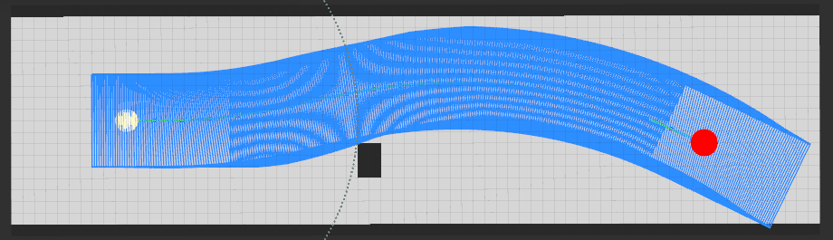

# Hybrid Astar base ROS

> 这是一个基于hybrid-Astar搜索算法的避障模块.目前包括:(地图生成模块、路径搜索模块、碰撞检测模块、轨迹优化模块、曲率显示模块)，所有的参数设置都能连接到hybrid_Astar.launch文件中，只需运行这个launch文件即可。

## 2019.12.13
* 1. 初步完成代码的编写, 能够通过简单的测试, 参数可通过rosparam命令进行实时修改
* 2. 缺少 final_path 模块
* 3. 缺少 collision detection 模块

## 2019.12.15
* 1. fix一些细节bug
* 2. 可以显示最终path(间距可调)
* 3. 缺少 collision detection 模块

## 2019.12.30
* 1. 添加 collision detection 模块
* 2. 添加 基于python 的 path optimize 模块 

## 2020.01.14
* 1. 添加 ’骑坑‘ 避障功能

## 2020.01.15
* 1. 修复了truck不能向正西方向行驶的的bug。原因，在CalculateHeuristic函数计算时，应计算current_node.yaw与goal.yaw之间的角度差值。yaw的范围为[-pi, pi], 当dis_yaw大于pi时,应使用 2pi-dis_yaw作为实际的差值
* 2. 改正了之前optimize path module中一直存在的错误, polyfix函数的第二种约束应该为tan(yaw)

## 2020.03.02
* 1. 修复了之前无法在终端中输入Ctrl+C后，程序无法直接关闭的bug,之前在call path_optimizer时使用waitForExistence()函数，现改为使用exists()函数
* 2. 添加了当path optimizer失效后的处理逻辑

## 2020.03.04
* 1. 修改了启发值函数，添加当前点到下一节点的yaw差值
* 2. 修改了扩展点的输入，当前为固定move_step,对转弯半径进行离散化。可设置的参数有：move_step_、segment_dis_(路径离散度)、extension_point_num_(扩展点个数)、min_turning_radius_(最小转弯半径)
* 3. 添加了一个简单的最终路径的评价 path_curvature_value_
* 4. 修改了map_create,能够自动识别所读取的text文本的size(heigh,width)
* 5. 将angle_size改为动态变化,随输入的move_step, min_turning_radius_而变化

## 2020.03.19
* 1. 修改了搜索过程中ID_index的类型为uint64,将其扩大了100倍,修复了扩展点pose不同id却相同的bug
* 2. 添加了曲率约束cost

## 2020.03.27
* 1. 优化了相差极小的两个point,ID相同的问题,之前是将x,y维度都扩大100倍,但这样会使得扩展点数增加很多.现优化过后,耗时明显减少,但最终获得的path在曲率变化率指标上下降了一些
* 2. 添加了matlibplotcpp,可以直接显示曲率plot
* 3. 将记录扩展点数的容器由set变为了multiset, 表示可以记录那些被重新扩展的点

## 2021.02.03
* 1. 在启发式中添加了距参考线距离的惩罚项，并调整了各惩罚项的权重
* 2. 修改车辆尺寸为中型轿车

## Result Show
### 下图是经过多次优化后的结果

